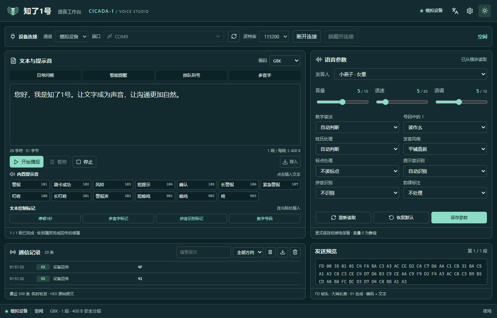
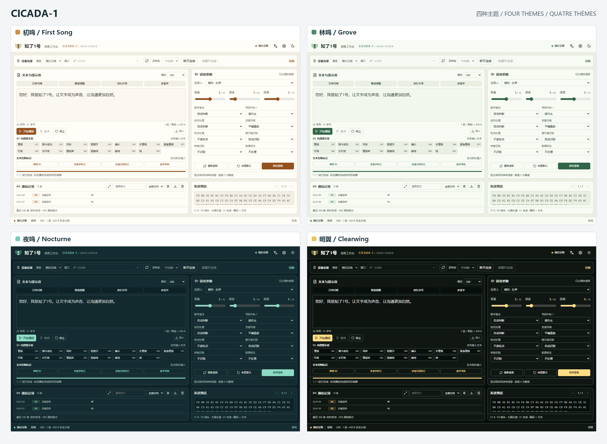

<p align="center">
  
  &nbsp;&nbsp;&nbsp;&nbsp;
  
</p>

<h1 align="center">知了1号 · CICADA-1</h1>

<p align="center">
  <a href="../README.md"></a>
  <a href="README.en.md"></a>
  <a href="README.fr.md"></a>
</p>

<p align="center">
  An open-source serial workbench for the CICADA-1 speech synthesis module
</p>

<p align="center">
  <a href="https://v2.tauri.app/"></a>
  <a href="https://www.rust-lang.org/"></a>
  <a href="https://react.dev/"></a>
  <a href="https://www.typescriptlang.org/"></a>
</p>

<p align="center">
  
  <a href="../LICENSE"></a>
</p>

CICADA-1 connects to a speech synthesis module over UART, bringing text editing, voice settings, built-in sounds and raw communication logs into one window. The desktop application uses Tauri, Rust and React/TypeScript. Audio comes from the module and its speaker.

## Features

- **Serial connection**: search by device name or port, enter a port manually, and choose 9600 / 57600 / 115200 / 460800 baud.
- **Speech playback**: GB2312, GBK, UTF-16LE, UTF-16BE and UTF-8 encoding; automatic text segmentation and sequential playback; pause, resume and stop.
- **Voice settings**: eight voices, volume, speed, pitch and Chinese reading options; save, read back or restore settings.
- **Text tools**: 13 built-in sounds, control tags, UTF-8 text import and locally saved drafts.
- **Communication logs**: raw HEX traffic, search, direction filters, log export and a frame preview for each text segment.
- **Device and appearance**: amplifier delays, sleep, wake-up, raw version responses, four themes, and Chinese and English application interfaces.

<p align="center"></p>

## Four themes

First Song, Grove, Nocturne and Clearwing offer warm white, soft green, deep teal and high-contrast palettes. Switch themes in Settings; your preference is saved automatically.

<p align="center">
  <a href="screenshots/themes-overview.png"></a>
</p>

## Quick start

### Requirements

The desktop instructions target Windows 10/11. Install Node.js 20 or a newer LTS version, Rust stable with the MSVC toolchain, Microsoft C++ Build Tools with the **Desktop development with C++** workload and Windows SDK, and Microsoft Edge WebView2 Runtime. See the [Tauri prerequisites](https://v2.tauri.app/start/prerequisites/) for installation details.

### Run from source

From the project root:

```powershell
npm ci
npm run desktop
```

To explore the interface in a browser:

```powershell
npm run dev
```

Open <http://127.0.0.1:1430> and select a simulated device. Browser mode does not access physical serial ports or generate audio.

### Connect and speak

1. Connect the USB-to-UART adapter's TX to the module's RX, RX to TX, and GND to GND. Use the module's required power supply and connect a speaker.
2. Select the actual serial port and the baud rate matching the module's BAUD0/BAUD1 pins, then connect.
3. Enter text, choose an encoding, review the byte count and segment preview, then start playback.
4. Adjust the voice settings and save them to the module. Use the communication log to inspect sent and received data.

UART voltage levels must match the module. Selecting a baud rate in the application configures the host only; it does not change the module's pin configuration. The module supports Chinese characters and English letters, but does not synthesize English words. Supplementary-plane characters, including most emoji, cannot be sent.

## Documentation

| Document | Contents |
| --- | --- |
| [User guide (Chinese)](USER_GUIDE.md) | Wiring, connection, playback, voice settings, sounds, logs and troubleshooting |
| [Communication protocol (Chinese)](PROTOCOL.md) | UART settings, frame format, commands, responses, encodings and control tags |

Each text segment is limited to **400 bytes**. The workbench waits for the previous segment's `4F` completion response before sending the next one. Control tags in text apply globally and persist across power cycles. Use `[d][m3]` to restore all defaults.

This README is available in [Chinese](../README.md), [English](README.en.md) and [French](README.fr.md). The detailed guide and protocol are in Chinese. The application interface supports Chinese and English.

## License

This project is licensed under the [Apache License 2.0](../LICENSE). Third-party licenses and notices are provided in [THIRD-PARTY-NOTICES.txt](../THIRD-PARTY-NOTICES.txt).
